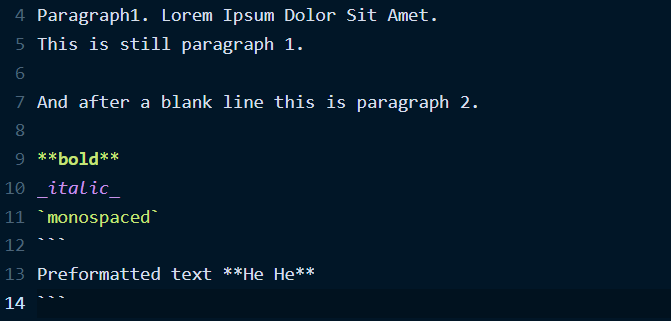
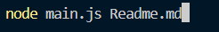
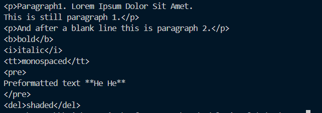
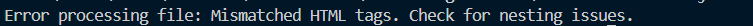
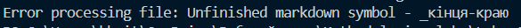

# Laba-1 
## Convert Markdown to HTML  


Цей консольний застосунок, розроблений для платформи Node.js, виконує одну просту операцію - перетворення текстових файлів, використовуючи розмітку Markdown, у валідний HTML.

### Теги які підтримає застосунок 
1. `**bold**` - **жирний текст** 
2. `_italic_` - _курсивний текст_
3. ``monospaced`` - `моноширнний текст`
4. ` ```
Preformatted text
``` ` - ```переформатований текст```
5. `~~shaded~~` - ~~заштрихований текст~~
6. `***bold_italic***` - ***жирний курсивний текст***

## Інструкція, як зібрати та запустити проект
Насмперед, переконайтеся чи у Вас встановлена `Node.js`.

Встановити можна [тут](https://nodejs.org/en). Перевірити встановлення: 
`node -v` 

1. Clone repoitory via git clone `https://github.com/makskhv21/Methodologies-labs.git`
2. Change your directory to Laba-1: `cd Laba-1`
3. Run `node main.js Readme.md`

## Інструкція до використання проекту
1. Написати будь-яку інформацію в файлі `.md`

2. В терміналі вести `node main.js file.md`

3. Якщо не буде знайдено помилок в `.md`

4. Але якщо будуть знайдені помилки, то в консолі результатом буде тип помилки



## Додаткова інформація 
Виконав роботу Хвиць Максим, ІМ-21.
1Revert-comit
1Revert-comit
