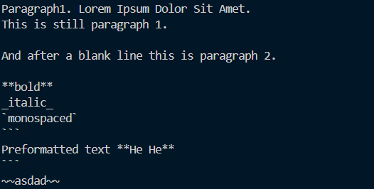
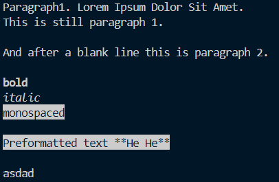
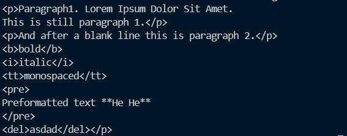
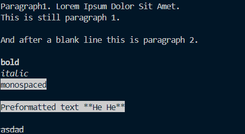
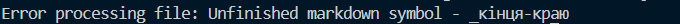
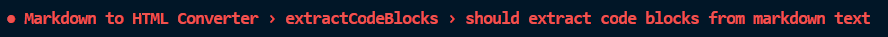

# Laba-2 
## Convert Markdown to HTML and ANSI

Цей консольний застосунок, розроблений для платформи Node.js, виконує одну просту операцію - перетворення текстових файлів, використовуючи розмітку Markdown, у валідний `HTML` та `ANSI Escape Codes`.

### Теги, які підтримає застосунок 
1. `**bold**` - `<b>жирний текст</b>` or `\x1b[1mbold text\x1b[22m`
2. `_italic_` - `<i>_курсивний текст_</i>` or `\x1b[3mitalic text\x1b[23m` 
3. ``monospaced`` - `моноширнний текст` or `\x1b[7mmonospaced text\x1b[27m`
4. `~~shaded~~` - `<del>заштрихований текст</del>` or `\x1b[7mзаштрихований текст\x1b[0m`
5. ` ```
Preformatted text
``` ` - ```<pre>переформатований текст</pre>``` 
or
`\x1b[7mпереформатований текст\x1b[27m`

6. `Paragraph1. Lorem Ipsum Dolor Sit Amet.
This is still paragraph 1.`
`And after a blank line this is paragraph 2.`  
&#8595;    
`<p>Paragraph1. Lorem Ipsum Dolor Sit Amet.
This is still paragraph 1.</p>`
`<p>And after a blank line this is paragraph 2.</p>`
or
`Paragraph1. Lorem Ipsum Dolor Sit Amet.
This is still paragraph 1.`
`And after a blank line this is paragraph 2.`

## Інструкція, як зібрати та запустити проект
Насамперед, переконайтеся чи у Вас встановлена `Node.js`.

Встановити можна [тут](https://nodejs.org/en). Перевірити встановлення: 
`node -v`.

1. Clone repository via git clone `https://github.com/makskhv21/methodologies-lab-2.git`
2. Run `node main.js Readme.md` or `node main.js Readme.md --format html`

## Інструкція як правильно запустити тести

У головній папці вести `npm test`

## Інструкція до використання проекту

1. Написати будь-яку інформацію в файлі `.md`.



2. У терміналі вести `node main.js file.md`. За замовчуванням буде виводитися `ANSI Escape Codes`



3. Також можна вибрати, у якому форматі ти хочеш вивести `Markdown`

- `node main.js file.md --format html`


 
- `node main.js file.md --format html`



4. Якщо буде помилка в Markdown, результатом буде, як приклад





## Додаткова інформація 

Виконав роботу Хвиць Максим, ІМ-21.

[Посилання на revert-comit](https://github.com/makskhv21/methodologies-lab-2/commit/040bfc0bc90d1a9acc63844647f9615fee7f2549)

[Посилання на провалений тест](https://github.com/makskhv21/methodologies-lab-2/commit/ee32edde586ff1f836cb680f7d9a9a1f92197023)

## Висновок 

У цій роботі я використовував Unit-тести, які допомогли мені переконатися, що окремі частини програмного коду (функції, методи) працюють правильно і відповідають специфікаціям перед кожною зміною коду. Вони сприяють покращенню якості програмного забезпечення, виявляючи помилки на ранніх стадіях розробки, що дозволяє ефективніше їх виправляти. Звичайно, написання тестів зайняли певний час, але результат того вартий, адже після цього мій застосунок став більш стабільним, надійним та якісним.
